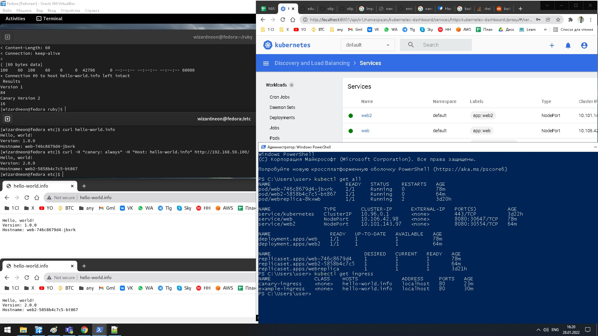

# kubernetes_homework 2

слева вверху на фото результат баш скрипта-распределение трафика при 10% за 100 запросов

ube-apiserver вместе с etcd, kube-scheduler, kube-controller-manager запускаются как статические поды и  управляются kubelet.
Статические поды управляются непосредственно демоном kubelet на конкретном узле, безAPI-сервера =.  kubelet наблюдает за каждым статическим подом (и перезапускает его в случае сбоя).

