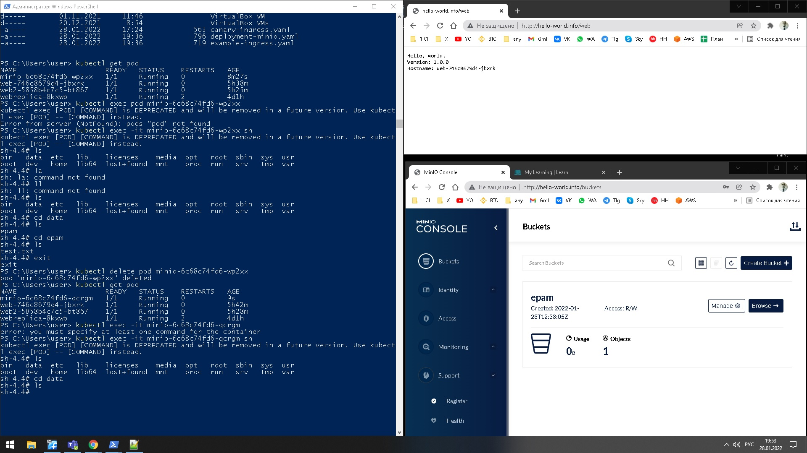

# kubernetes_homework 3

создаем ведро с названием epam и тестовым фалом test.txt проверяем они лежат в /data
удаляем под. Создается новый. Заходим в директорию /data . Данные утерянны ( ожидаемое поведение emptyDir: {} )

При монтировании удаленного ресурса NFS ожидаемое поведение после удаления пода - данные остануться в сохранности.
